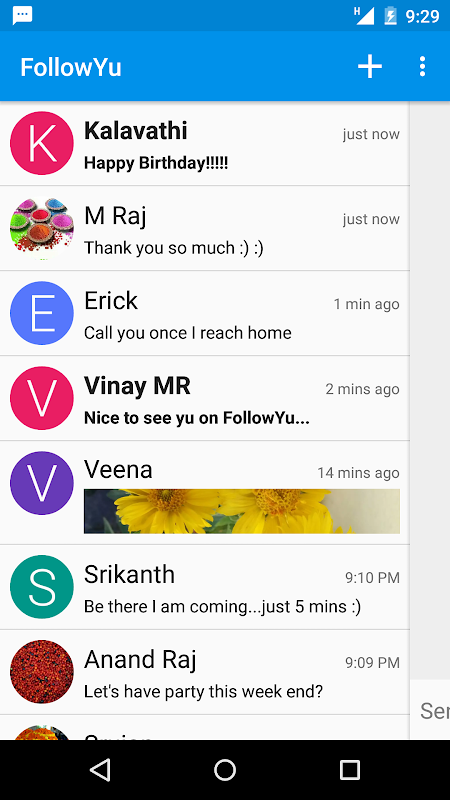

# followyu
FollowYu Messegner - an open-source chat messenger app based on conversations

# Technology
## Backend
- Erlang
- XMPP protocol
- Ejabberd
- Free BSD

## Frontend
- Android 4.0+
- Java
- OTR Encription

## Hardware/Cloud
- Linux
- Digital Ocean

# App Description
- Simple to start and use. Key your mobile number, followyu verifies with missed call alert and start chating!
- Instantly reach your friends and family in your life—for free. Messenger is a communications messaging app just like texting, but you don't have to pay for every message (it works with your data plan or Wi-Fi).
- Photos and videos: Snap photos or selfies right from the app and send them with one tap. Select videos from gallery and share them easily.
- Files: Send all kinds of non media supported files and documents like pdf,zip,doc,ppt and many more attachments.
- Secure: Supports secure text messaging chat with end to end OTR encryption.
- Multi device chat: You can keep chatting and message people from more than one phone or tablet.
- SIM free: Even messaging works on SIM free smartphone or tablet with verified mobile number.
- Ability to block contacts. No interruptions when you don’t want to chat with them.
- Turn off notifications when you are working, sleeping or taking break from chatting.
- Know Typing when people are typing.
- Tick mark status when people have read your messages.
- Keep the chat going while you use other apps.
- Ability to turn off the app when you want to avoid data usage.
- Forward or share the text, photos or files.
- Record voice messages and send them.
- Search for people in contacts with their name text or mobile number. Even you can filter online contacts.
- Know the online status right from the send icon itself while messaging.
- Always logged in so you never miss a message.
- FollowYu Messenger is supported on smartphones running Android 4.0 and above.

- Note: Product has been shutdown, no more maintained and available on Google PlayStore
- Credits: Conversations and open source community

# Welcome

# Contacts

# Chats Home

# On going conversation

# App Push Notifications

